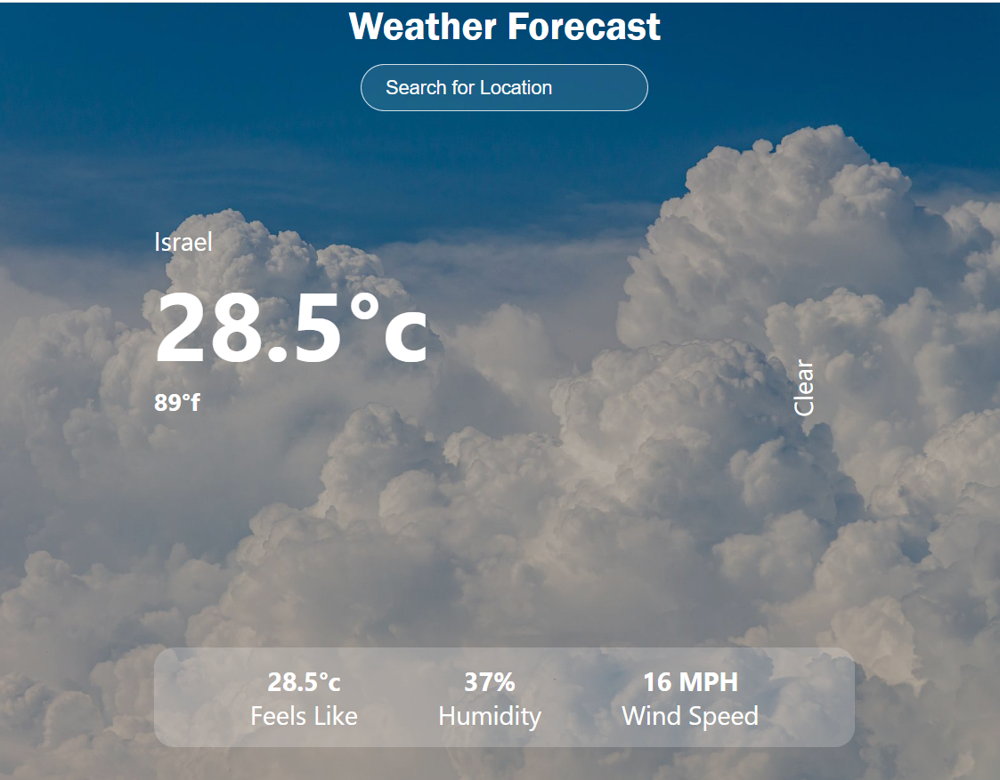

## Weather Forecast
I built a weather project that syncs with the API of:
 https: //openweathermap.org/current
On the main page we will enter a city / country and press Enter, we will get the exact weather in the country, 
* cloud condition (cloudy, clean, rainy, etc ..),
In addition we have a display of:
* Feels like. 
* Humidity.
* and the exact wind speed for the time being.

url : https://ohadweather.netlify.app

Enjoy!